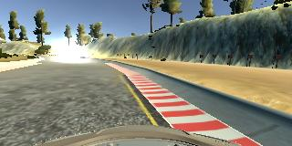
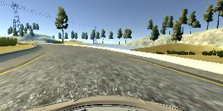

# **Behavioral Cloning** 

---

**Behavioral Cloning Project**

The goals / steps of this project are the following:
* Use the simulator to collect data of good driving behavior
* Build, a convolution neural network in Keras that predicts steering angles from images
* Train and validate the model with a training and validation set
* Test that the model successfully drives around track one without leaving the road
* Summarize the results with a written report

####Left Recovery Image
 
####Right Recovery Image

#### Center Image

This writeup will explain the steps I took in order to complete the project.  Please refer to 
[README](./README.md) for the list of the files and instructions on running the project.

I decided to reuse Lenet CNN from the Traffic Sign Classifier for this project.  I reimplemented LeNet using Keras.
In addition to the previously used RELU Activation, MaxPool2D, Conv2D, Dense I added the following to the network:
* The very last layer is Dense(1) to output only 1 steering angle (or do linear regression).  
* As I was experiencing non-decreasing validation and decreasing training loss during training, I inserted lots of Dropout layers to deal with
overfitting.
See implementation [lenet.py](./lenet.py)

My final model consisted of the following layers:

| Layer         		|     Description	        					| 
|:---------------------:|:---------------------------------------------:| 
| Input/Lambda         	| 80x160x3 RGB image (resized)					| 
| Cropping2D         	| cropping=((25, 10),(0, 0))     				| 
| Convolution 3x3     	| 3x3 kernel, 1x1 stride, 6 filters             |
| RELU					|												|
| Convolution 5x5     	| 5x5 kernel, 1x1 stride, 16 filters        	|
| RELU					|												|
| Max pooling	      	| 2x2 pool, 2x2 stride             				|
| Dropout   	      	| 50%            				                |
| Convolution 2x2	    | 1x1 stride, VALID padding, 26 filters      	|
| RELU					|												|
| Dropout   	      	| 50%            				                |
| Convolution 3x3	    | 1x1 stride, VALID padding, 52 filters      	|
| RELU					|												|
| Max pooling	      	| 2x2 pool, 2x2 stride             				|
| Dropout   	      	| 50%            				                |
| Flatten   	      	|             				                |
| Fully connected 1		| size 400        								|
| RELU					|												|
| Dropout   	      	| 60%            				                |
| Fully connected 2		| size 120        								|
| RELU					|												|
| Dropout   	      	| 60%            				                |
| Fully connected 3		| size 60       								|
| RELU					|												|
| Dropout   	      	| 60%            				                |
| Fully connected 4		| size 1       								|
|						|												|

In [SteeringAnglePredictor](./steering_angle_predictor.py), I used Adam optimizer, which adjusted the learning rate automatically.
The only training parameters available to vary are BATCH_SIZE and number of EPOCHS in `model.py`
As it's a linnear regression problem, I used _mean squared error_ to fit the data.

In order to speed up training and deal with limited GPU memory:
1. I resized the images on the hard drive. I was concerned about training efficiency.  I should have just resized the images
in the generator.  
2. I implemented keras.utils.Sequence instead of generator (see lecture code) in order to reduce amount of GPU memory used.
The Sequence was passed to `model.generator_fit` method.
3. I added `Lambda` CNN layer to normalize the data.
4. I added `Cropping2D` CNN layer, to remove top and bottom pixels from training, as those do not contain the information in this case.
5. On each subsequent iteration of training runs, I passed the previous training model to SteeringAnglePredictor.  This allowed the model to
converge a lot quicker. (see `prevModel` parameter in SteeringAnglePredictor)

I used the following data and performed the following training runs to collect the training data (data not included).  
I collected the data in the follwoing order:
* data -  provided by Udacity
* col_data2 - regular driving
* col_data4_rev - driving clockwise.  
* col_data3 - recovery run. I tried to use the left and right camera images with adjusted steering angles; however, that 
made the model drive worse.  So, I decided on the recovery data collection strategy.
* 2nd_track1 - 2nd track run inclusing 3 laps of driving, 1 lap of recovery driving, 1 lap of smooth driving.

I collected over 65K data points in addition to those provided by Udacity (70K total).  20% of the data were used to validate the results
against over/underfitting during training.  I only used center camera images without flipping them.

The model generalized well, as the car was almost able to finish the 2nd track.

Video of the autonomous driving is in `video.mp4`.
To launch the simulator, refer to [README](./README.md)
